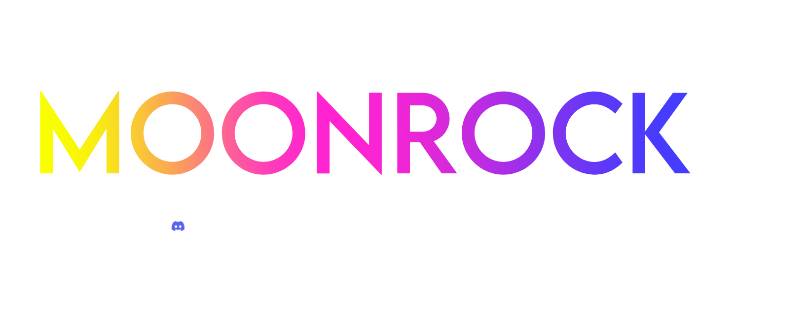

[](https://discord.gg/rXbGpfuKmV)
[](https://discord.gg/rXbGpfuKmV)

## Exclusive to Moonrock 🌕
- Custom Optional Loading popup
- Unique Design, Mixed with csgo and a modern styled ui
- Tab Button Sections
- built-in Settings Tab
- And More To Come
<br/>

### Starting Moonrock
```lua
local Library = loadstring(game:HttpGet("comingsoon.lua"))()
```

### Loading Screen (optional)
```lua
Library.load.CreateLoader({
    Title = "Moonrock Hub",
    Thumbnail = "35500340", -- This must be the ID of the image you want to be the thumbnail.
    Discord = {
        Invite = "rXbGpfuKmV" -- You do not need to have the "https://discord.gg/" part of the invite here, only the code.
    }
})
```

### Creating Window
```lua
Library:CreateWindow({
    Title = "Moonrock │ discord.gg/rXbGpfuKmV │ Exploit with style",
    Discord = {
        Invite = "rXbGpfuKmV" -- You do not need to have the "https://discord.gg/" part of the invite here, only the code.
    },
    ConfigSaving = {
        Enabled = true,
        FolderTitle = "Moonrock",
        FileTitle = "Moonrock Hub"
    }
})
```
<br/>

# Window Elements 
### Creating a Tab
```lua
local ExampleTab = Library:CreateTab("Moonrock")
```
### Creating a Section
```lua
local ExampleSection = Library:CreateTabSection("Aimbot")
ExampleSection.CreateSectionTab("Visuals")
ExampleSection.CreateSectionTab("Trolling")
ExampleSection.CreateSectionTab("Misc")
ExampleSection.CreateSectionTab("Settings")
```
### Creating Group Box (required)
```lua
local GroupBox = Tab:CreateGroupBox({Title = "Moonrock", Side = "Left"})
```
<br/>

### Creating a button
```lua
GroupBox:CreateButton({
    Title = "Hello, world!",
    Callback = function()
        print("hello world")
    end
})
```

### Creating a Toggle
```lua
GroupBox:CreateToggle({
	Title = "I am a toggle!",
	Callback = function(Value)
		print(Value)
	end
})
```

### Creating a Keybind
```lua
GroupBox:CreateKeybind({
	Title = "Keybind",
	Bind = nil, -- The starting key example is Q. Leave this as nil to have no keybind to start with.
	Callback = function()
		print("Hello, Moonrock!")
	end
})
```

### Creating a Slider
```lua
GroupBox:CreateSlider({
	Title = "WalkSpeed",
	Range = {0, 500}, -- Minimum and maximum values of the slider
	StartValue = 16,
	Increment = 5, -- How much the slider will increment the value each pixel.
	Callback = function(WalkSpeed)
		game:GetService("Players").LocalPlayer.Character.Humanoid.WalkSpeed = WalkSpeed
		print(WalkSpeed)
	end
})
```

### Creating a Dropdown
```lua
GroupBox:CreateDropdown({
	Title = "Example Dropdown",
	Options = {"First option!", "Second option!"}, 
	MultipleOptions = true,
	Callback = function(Option)
		print("Selected option:", Option)
	end
})
```

### Creating a Color Picker
```lua
GroupBox:CreateColorPicker({
	Name = "Pick me! I'm a color!",
	Color = Color3.fromRGB(255, 0, 0),
	Callback = function(Value)
		print(Value)
	end
})
```
